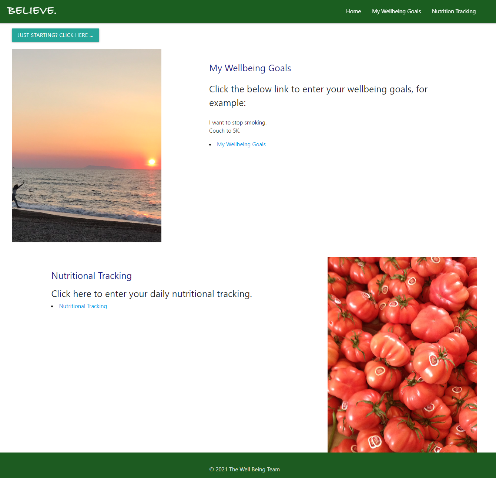
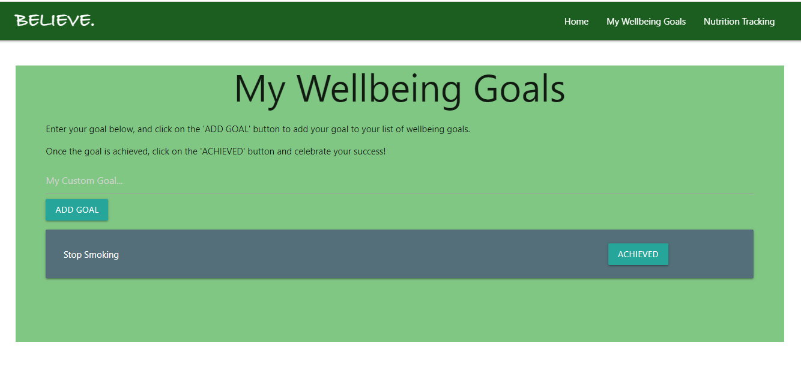
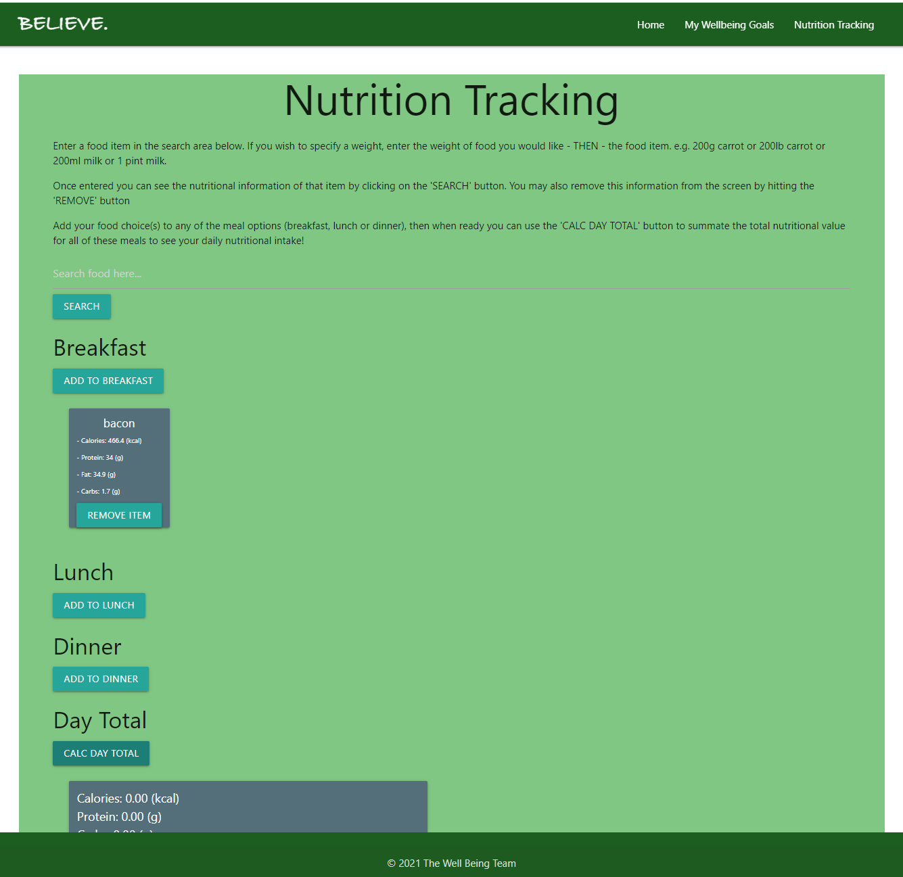

# Believe.
A wellbeing site for setting and tracking goals

*   GitHub Repository [Believe. Repository](https://sallyxp.github.io/believe)
*   GitHub Pages URL [Believe Website](https://github.com/sallyxp)
---

## Introduction.

Believe. is intended to be both a website to help the end-user monitor their 

Nutritional intake and also help them to record their goals with additional help to 

useful motivational/informative pages.   

---

## Pseudo Code
The website principally has 3 pages: 

* The Index page is intended to first greet the user and be attractive enough to encourage them to proceed further.

* In the top corner there is a command button which opens a Modal to welcome the user for the first time.  

* The Modal displays an random inspirational message (generated from a web API) which, on each press, will provide a new message.

* The first two section on the home page are to encourage the user to view the sites other pages.

* By the final image, there are links to external sites (related to Mental Health, NHS and Meditation).

* There is a navbar which contains links to the rest of the site. (These links link to the same pages as the links beside the images do, however the navbar is consistent throughout the site.

*  My Wellbeing Goals links via an href to My-Wellbeing.Html - This page is for an end user to add their own goals.

*  Nutrition Tracking links via an href to Nutrition-Tracking.Html - This page allows the user to calculate their daily nutritional intake:
    *   Calories 
    *   Protein 
    *   Fat
    *   Carbohydrate 

---

<br>


##  Using The Believe. Website

*   On the home page you can click ```'JUST STARTING? CLICK HERE'``` for an inspiration random quote and welcome message.



*   On the Wellbeing page you can create your own goals by typing in the input area, any goal name that is personal to you, and once achieved close by clicking the ```'ACHIEVED'``` button.



*   On the Nutrition page there are instructions on the top of the page.
*   You can either search for a food item by weight or just a standard weight by the name of a food item
*   You can then add the returned search by selecting either of the following:
    *   ```ADD TO BREAKFAST```
    *   ```ADD TO LUNCH```
    *   ```ADD TO DINNER```
*   You can then see your nutitional stats for your meals for that current day by clicking on the ```'CALC DAY TOTAL'```.
*   If you accidentally add too many of an item you can simply click ```'REMOVE ITEM'``` on the item itself.
*   If you had already calculated the day total after removing an item, clicking ```'CAL DAY TOTAL'``` will recalculate the total for you.




---

<br>

## Next Steps & Enhancements

*   We would deploy the link and get feedback from the user and make adjustments accordingly.
*   We would pursue any avenues of interest in the form of collaboration and ideas.
*   Look to Store the meals in local storage, or a Database.
*   Add the current date & time to each meal on Nutrition Tracking meals.
*   Present the days as summary cards to a daily history page.
*   Provide the ability to track meal trends for discovery & identification of allergies.


---

<br>


## Credits

*   University of Birmingham [Coding Boot Camp](https://bootcamp.birmingham.ac.uk/coding/)
*   The Net Ninja [Materialize Tutorial](https://www.youtube.com/playlist?list=PL4cUxeGkcC9gGrbtvASEZSlFEYBnPkmff)
*   An invaluble JavaScript and jQuery research tool [Stack Overflow](https://stackoverflow.com/)
*   Further syntax help when finding a solutions [w3schools](https://www.w3schools.com/)
*   Positive quotes from [FreeCodeCamp](https://forum.freecodecamp.org/t/free-api-inspirational-quotes-json-with-code-examples/311373)
*   Calorie Ninjas [API Documentation](https://rapidapi.com/calorieninjas/api/calorieninjas)
*   Nutritionix - Nutrition Database Overview at [RapidAPI](https://rapidapi.com/msilverman/api/nutritionix-nutrition-database/details)

---
<br>


<br>

---
© 2021 The Project #3 Wellbeing Team!
